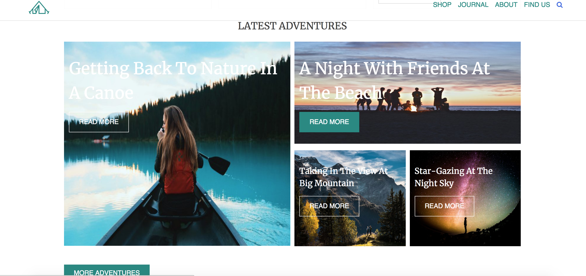
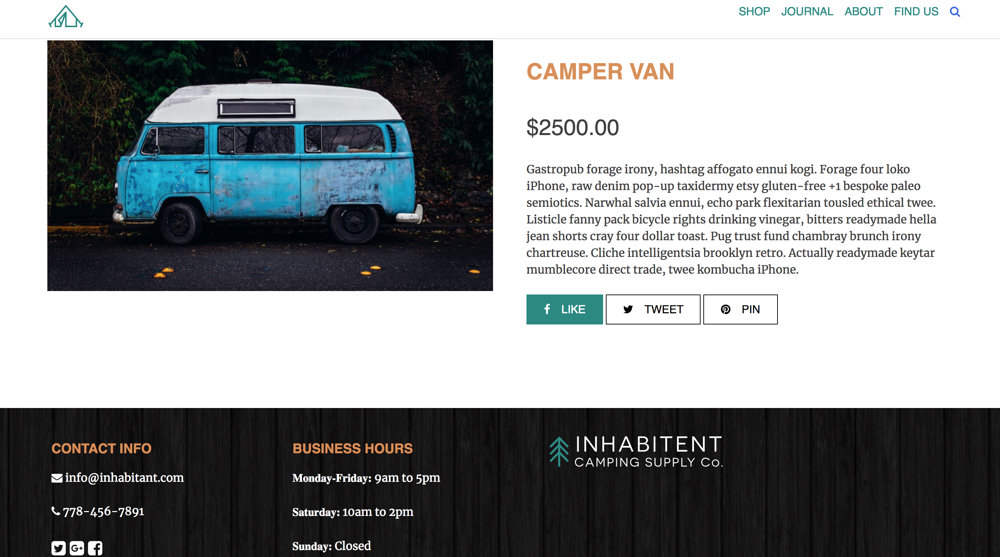

## Inhabitent Camping Supply Co. Website

* Utilizing WordPress, PHP, SCSS, and HTML, I have created a custom WordPress       theme for the Inhabitent Camping Supply Co. website.
 The site contains many blog posts, products and descriptions, a custom homepage, an about page, and a find us page.

## Author

* Tony

* Based on

* RED Starter Theme (forked from Underscores)
* RED Widget Boilerplate

## Dependencies

* Run npm install inside theme directory to install the node modules for Gulp, etc.

## Technologies Used

* Wordpress
* PHP
* javascript
* Plugins
* Databases
* Gulp
* Jquery
* HTML
* CSS
* SASS
* Functionality:

## Built using WordPress CMS

* Contain a custom static homepage, About page, Contact page (with a * functioning   contact form)
* Contain a blog post index page and a single view for blog posts
* Contain a product archive, a product type archive page, and single template for    products
* Contain a search results page and 404 page

## ScreenShots

